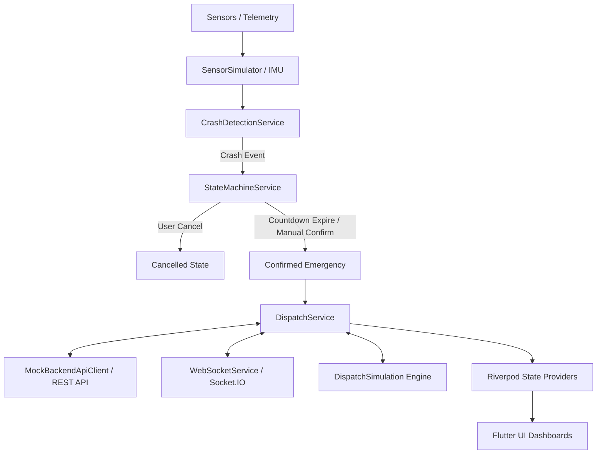
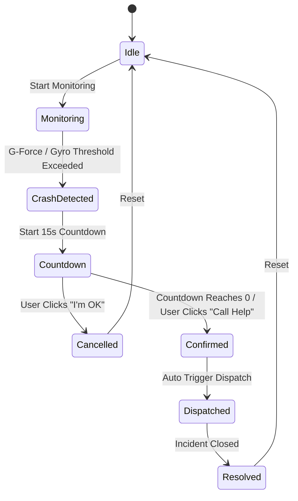

# RescueLink Emergency Response System - Architecture Document

## 1. System Architecture Overview

The system provides an end-to-end autonomous crash detection, emergency confirmation, and multi-agency response workflow.

## 2. Component Responsibilities

### 2.1 State Machine Lifecycle

### 2.2 Dispatch Lifecycle (`DispatchStatus`)
1. **`idle`**: No active emergency.
2. **`searching`**: System queries nearest available ambulances within 10km and trauma hospitals.
3. **`dispatched`**: Alert dispatched to closest responder.
4. **`acknowledged`**: Responder accepts the assignment.
5. **`enRoute`**: Responder en route to scene with real-time GPS telemetry.
6. **`arrived`**: Responder arrives on scene for triage.
7. **`transporting`**: Patient in ambulance moving towards designated trauma center.
8. **`delivered`**: Patient delivered safely to emergency department.
9. **`completed`**: Incident resolved.
10. **`cancelled`**: Dispatch aborted.
11. **`failed`**: No responders available within range or system failure.

## 3. Real-time Communication
- Duplex WebSocket connection using Socket.IO events.
- Rooms/channels segmented by `incidentId`.
- Bidirectional updates for location, status transitions, and cancellations.
